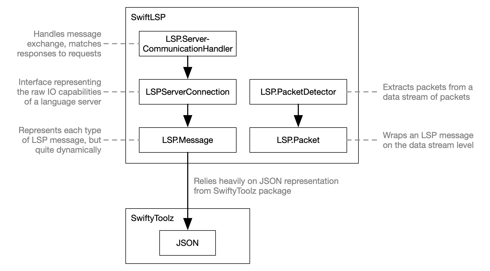
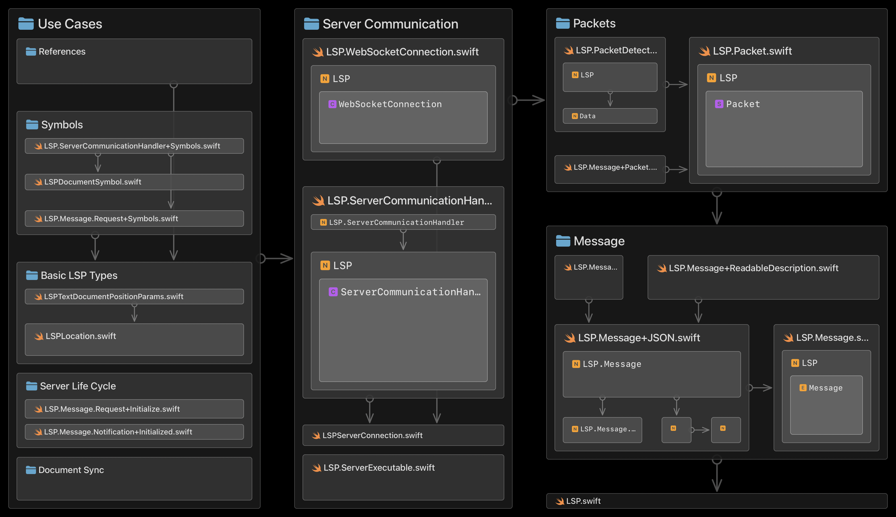

# SwiftLSP

👩🏻‍🚀 *This project [is still a tad experimental](#development-status). Contributors and pioneers welcome!*

## What?

SwiftLSP offers a quite dynamic Swift representation of the [LSP (Language Server Protocol)](https://microsoft.github.io/language-server-protocol) and helps with many related use cases. It is foundational for [LSPService](https://github.com/codeface-io/LSPService) and [LSPServiceKit](https://github.com/codeface-io/LSPServiceKit).

Since the LSP standard defines a complex amorphous multitude of valid JSON objects, it doesn't exactly lend itself to being represented as a strict type system that would mirror the standard down to every permutation and property. So SwiftLSP is strictly typed at the higher level of LSP messages but falls back onto a more dynamic and flexible JSON representation for the details. The strict typing can easily be expanded on client demand.

## How?

Some of these examples build upon preceding ones, so it's best to read them from the beginning.

### Create Messages

```swift
let myRequest = LSP.Request(method: "myMethod", params: nil)
let myRequestMessage = LSP.Message.request(myRequest)

let myNotification = LSP.Notification(method: "myMethod", params: nil)
let myNotificationMessage = LSP.Message.notification(myNotification)
```

### Encode and Decode Messages

SwiftLSP encodes LSP messages with the [LSP-conform JSON-RPC encoding](https://microsoft.github.io/language-server-protocol/specifications/lsp/3.17/specification/#abstractMessage).

```swift
let myRequestMessageEncoded = try myRequestMessage.encode()  // Data
let myRequestMessageDecoded = try LSP.Message(myRequestMessageEncoded)
```

### Wrap Messages in Packets

To send LSP messages via data channels, the standard defines how to [wrap each message](https://microsoft.github.io/language-server-protocol/specifications/lsp/3.17/specification/#baseProtocol) in what we call an `LSP.Packet`, which holds the `Data`  of its `header`- and `content` part.

```swift
let myRequestMessagePacket = try LSP.Packet(myRequestMessage)
let packetHeader = myRequestMessagePacket.header     // Data
let packetContent = myRequestMessagePacket.content   // Data
let packetTotalData = myRequestMessagePacket.data    // Data
```

### Extract Messages From Packets

```swift
let myRequestMessageUnpacked = try myRequestMessagePacket.message()  // LSP.Message
```

### Extract Packets From Data

A client talking to an LSP server might need to extract `LSP.Packet`s from the server's output `Data` stream.

SwiftLSP can parse an `LSP.Packet` from the beginning of a `Data` instance:

```swift
let dataStartingWithPacket = packetTotalData + "Some other data".data(using: .utf8)!
let detectedPacket = try LSP.Packet(parsingPrefixOf: dataStartingWithPacket)

// now detectedPacket == myRequestMessagePacket
```

SwiftLSP also offers the `LSP.PacketDetector` for parsing a stream of `Data` incrementally:

```swift
var streamedPacket: LSP.Packet? = nil
        
let detector = LSP.PacketDetector { packet in
    streamedPacket = packet
}

for byte in dataStartingWithPacket {
    detector.read(byte)
}

// now streamedPacket == myRequestMessagePacket
```

## More Use Cases

Beyond what the examples above have touched, SwiftLSP also helps with:

* Creating messages for specific use cases (initialize server, request symbols, request references ...) 
* Launching an LSP server executable
* Matching response messages to request messages
* Making requests to an LSP Server through `async` functions
* Using an LSP Server via WebSocket

## Architecture

Some context and essential types:



Internal architecture (composition and essential dependencies) of the top-level source folder:



The above image was generated with the [codeface app](https://codeface.io).

## Development Status

From version/tag 0.1.0 on, SwiftLSP adheres to [semantic versioning](https://semver.org). So until it has reached 1.0.0, its API may still break frequently, but this will be expressed in version bumps.

SwiftLSP is already being used in production, but [Codeface](https://codeface.io) is still its primary client. SwiftLSP will move to version 1.0.0 as soon as its basic practicality and conceptual soundness have been validated by serving multiple real-world clients.