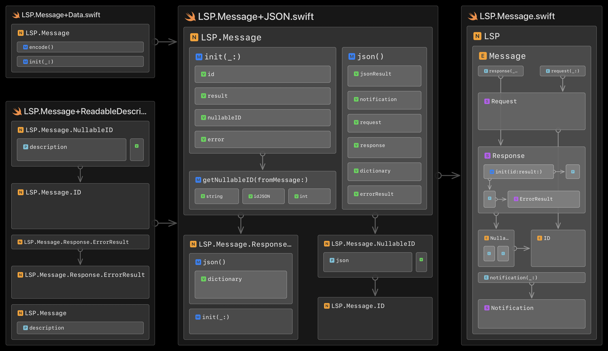

# SwiftLSP

... employs a quite dynamic Swift representation of the [LSP (Language Server Protocol)](https://microsoft.github.io/language-server-protocol) and helps with:

* Launching an LSP server executable
* Extracting LSP Packets from a data stream
* Encoding and decoding LSP messages
* Representing, creating and working with LSP messages
* Matching response messages to request messages
* Exchanging LSP Messages with an LSP Server
* Exchanging LSP Messages with an LSP Server via WebSocket

SwiftLSP is the basis for [LSPService](https://github.com/flowtoolz/LSPService) and [LSPServiceKit](https://github.com/flowtoolz/LSPServiceKit).

## Architecture

Some context and essential types:

The following are architecture diagrams of the top-level source folders, generated with the [Codeface.io](https://www.codeface.io) app:

### SwiftLSP

### Use Cases

### Server Communication

### Packets

### Message

